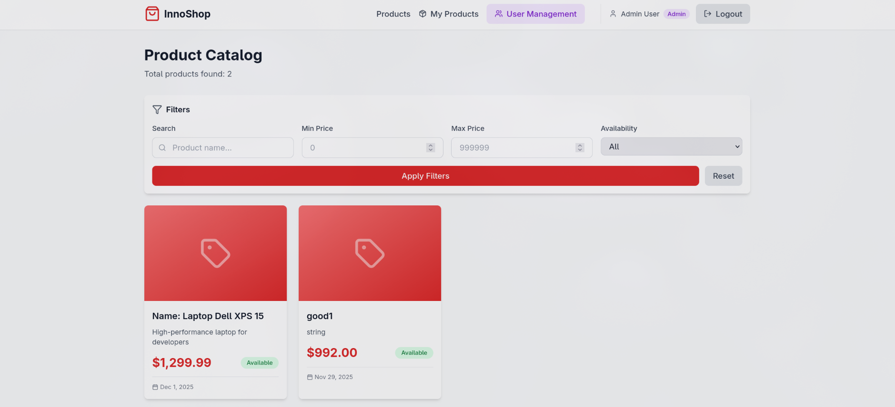
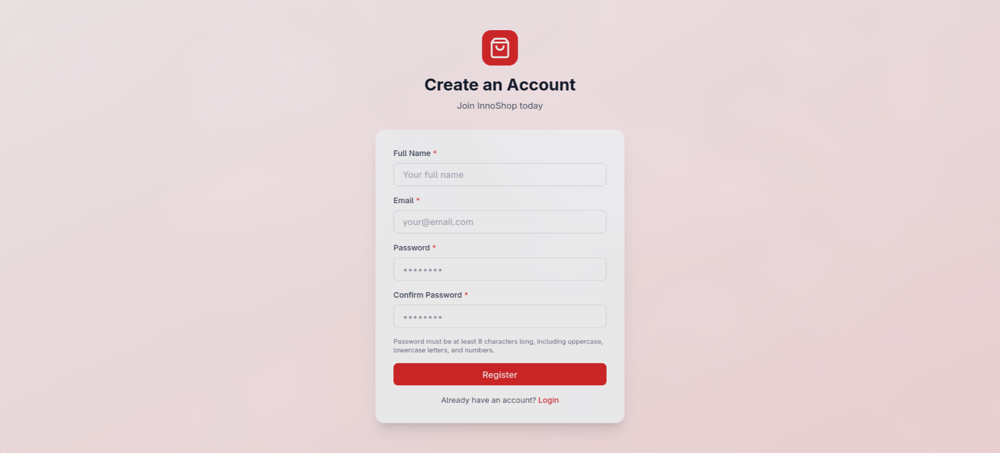
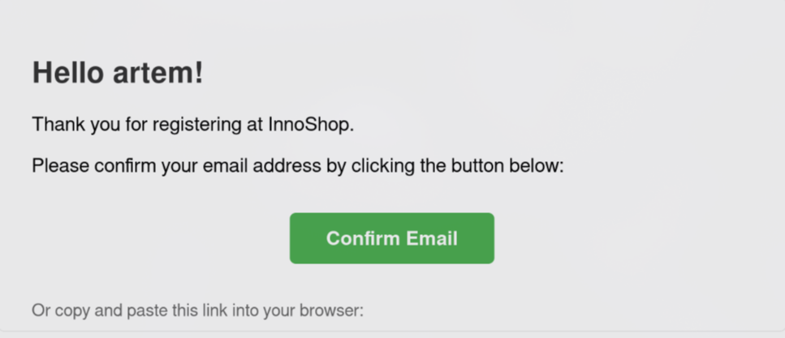
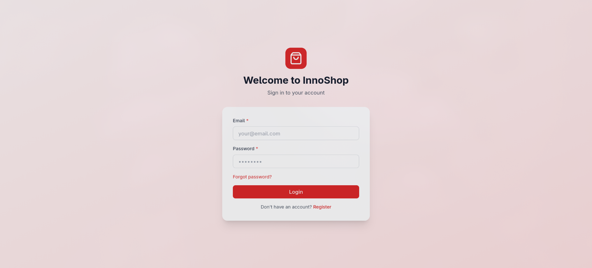
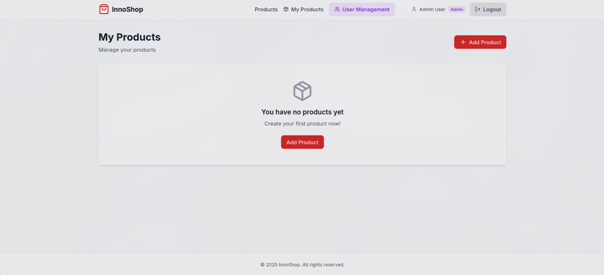
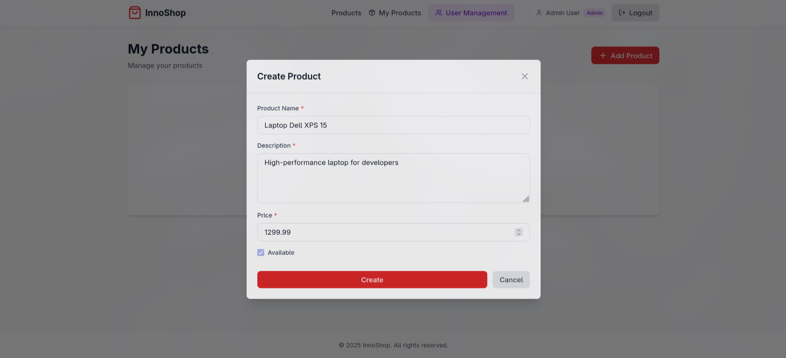
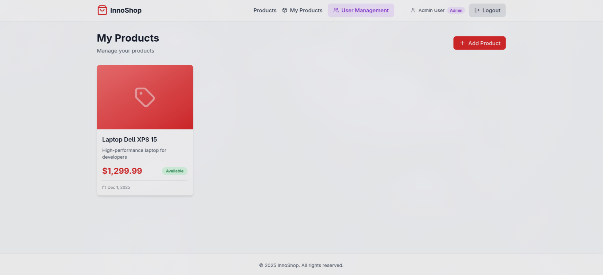
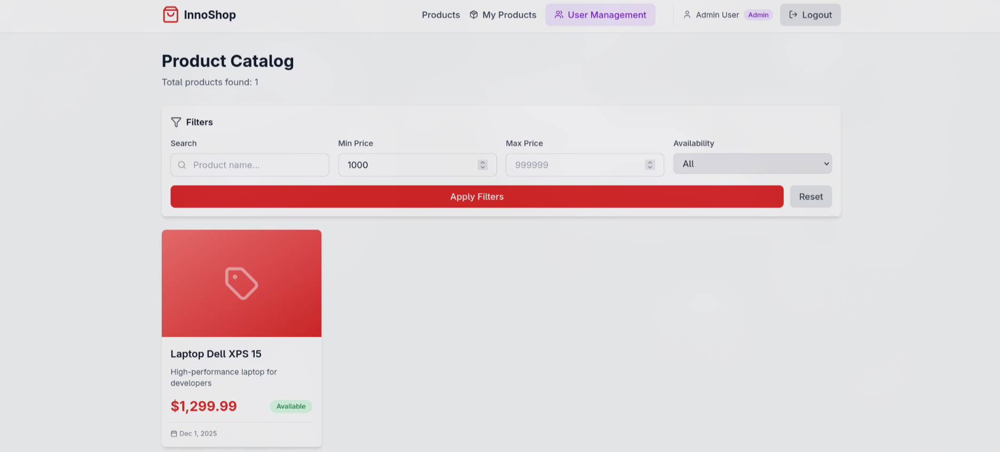
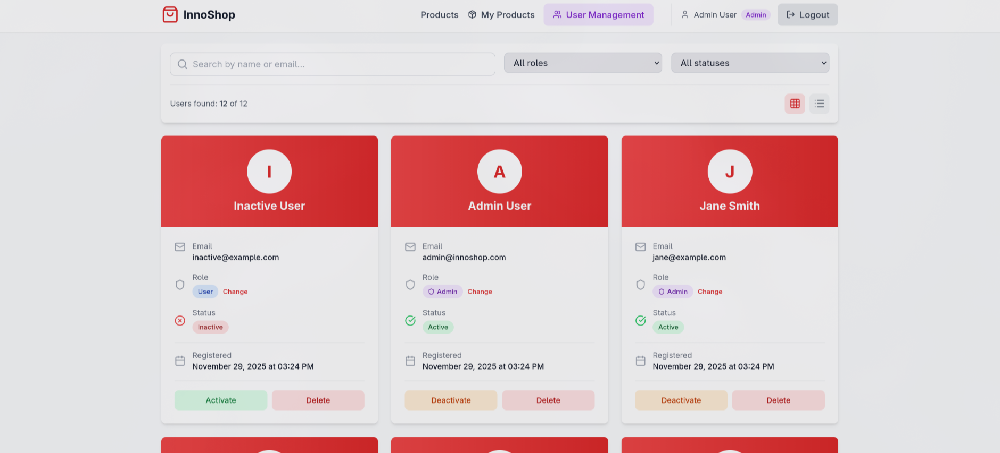

# InnoShop - E-Commerce Microservices Platform

A modern e-commerce platform built with microservices architecture, featuring user management and product catalog services with React frontend.


## 📋 Table of Contents

- [Overview](#overview)
- [Architecture](#architecture)
- [Features](#features)
- [Tech Stack](#tech-stack)
- [Project Structure](#project-structure)
- [Getting Started](#getting-started)
- [API Documentation](#api-documentation)
- [Screenshots](#screenshots)
- [Testing](#testing)
- [Contributing](#contributing)

## 🎯 Overview

InnoShop is a microservices-based e-commerce platform that demonstrates modern software architecture principles. The system consists of two independent microservices communicating via REST APIs and RabbitMQ message broker, with a responsive React frontend.

### Key Highlights

✅ **Clean Architecture** - Follows Onion/Clean Architecture principles with clear separation of concerns  
✅ **Microservices** - Independent, scalable services for Users and Products  
✅ **Event-Driven** - RabbitMQ integration for asynchronous inter-service communication  
✅ **Comprehensive Testing** - Unit and integration tests with high coverage  
✅ **Docker Ready** - Complete containerization with docker-compose  
✅ **Modern Frontend** - React SPA with Tailwind CSS  
✅ **Security First** - JWT authentication, email confirmation, password recovery  

## 🏗 Architecture

The application follows a microservices architecture with the following components:

```
┌─────────────────────────────────────────────────────────────┐
│                     React Frontend                           │
│                  (innoshop-frontend)                         │
└─────────────────────────────────────────────────────────────┘
                           │
          ┌────────────────┴────────────────┐
          │                                  │
┌─────────▼──────────┐            ┌─────────▼──────────┐
│  Users Service     │            │  Products Service  │
│  (Port 5001)       │◄──────────►│  (Port 5002)       │
│                    │  RabbitMQ  │                    │
│  - Authentication  │            │  - Product CRUD    │
│  - User Management │            │  - Search/Filter   │
│  - Email Service   │            │  - User Validation │
│  - JWT Tokens      │            │                    │
└────────────────────┘            └────────────────────┘
         │                                   │
         ▼                                   ▼
   ┌──────────┐                       ┌──────────┐
   │ SQLite   │                       │ SQLite   │
   │ Database │                       │ Database │
   └──────────┘                       └──────────┘
```

### Architecture Layers (Clean Architecture)

Each microservice follows the Clean Architecture pattern:

- **Domain Layer** - Entities, enums, exceptions, value objects
- **Application Layer** - DTOs, interfaces, services, validators, events
- **Infrastructure Layer** - Repositories, database context, external services
- **API Layer** - Controllers, middleware, configuration

## ✨ Features

### User Management Service

- 🔐 **Authentication & Authorization**
  - JWT-based token authentication
  - Role-based access control (User, Admin)
  - Refresh token mechanism
  
- 📧 **Email Features**
  - Email confirmation on registration
  - Password recovery via email
  - Mailtrap integration for email delivery

- 👥 **User Operations**
  - CRUD operations for user profiles
  - User activation/deactivation (Admin only)
  - Role management

- 🔔 **Event Publishing**
  - Publishes user lifecycle events (activated, deactivated, deleted)
  - RabbitMQ integration for event-driven architecture

### Product Management Service

- 📦 **Product CRUD**
  - Create, read, update, delete products
  - Owner-based authorization (users can only modify their own products)
  
- 🔍 **Advanced Search & Filtering**
  - Search by name and description
  - Filter by price range
  - Filter by availability
  - Pagination support

- 🎯 **Event Consumption**
  - Listens to user events from Users Service
  - Automatic product soft-delete on user deactivation
  - Product restoration on user activation

### Frontend Application

- 🎨 **Modern UI/UX**
  - Responsive design with Tailwind CSS
  - Clean and intuitive interface
  
- 🔑 **Authentication Pages**
  - Login and registration
  - Email confirmation
  - Password recovery and reset

- 🛍 **Product Management**
  - Product listing with filters
  - My Products page
  - Add/Edit/Delete products

- 👑 **Admin Panel**
  - User management dashboard
  - Activate/deactivate users
  - Role management

## 🛠 Tech Stack

### Backend

- **Framework**: ASP.NET Core 8.0
- **Architecture**: Clean Architecture (Onion)
- **ORM**: Entity Framework Core 9.0
- **Database**: SQLite (easily swappable to PostgreSQL/SQL Server)
- **Validation**: FluentValidation
- **Messaging**: RabbitMQ
- **Authentication**: JWT Bearer Tokens
- **Mapping**: AutoMapper
- **Email**: Mailtrap
- **Testing**: xUnit, Moq, FluentAssertions

### Frontend

- **Framework**: React 18.x
- **Styling**: Tailwind CSS
- **HTTP Client**: Axios
- **Routing**: React Router DOM
- **Icons**: Lucide React

### DevOps

- **Containerization**: Docker & Docker Compose
- **Web Server**: Nginx (for frontend)
- **Message Broker**: RabbitMQ

## 📁 Project Structure

```
InnoShop/
├── docker-compose.yml                 # Main orchestration file
├── innoshop-frontend/                 # React frontend
│   ├── src/
│   │   ├── api/                      # API integration
│   │   ├── components/               # React components
│   │   ├── context/                  # Context providers
│   │   ├── hooks/                    # Custom hooks
│   │   ├── pages/                    # Page components
│   │   └── utils/                    # Utilities
│   └── Dockerfile
└── src/
    ├── InnoShop.Users/               # Users microservice
    │   ├── InnoShop.Users.API/       # API layer
    │   ├── InnoShop.Users.Application/   # Application layer
    │   ├── InnoShop.Users.Domain/        # Domain layer
    │   ├── InnoShop.Users.Infrastructure/ # Infrastructure layer
    │   └── InnoShop.Users.Tests/     # Test project
    └── InnoShop.Products/            # Products microservice
        ├── InnoShop.Products.API/
        ├── InnoShop.Products.Application/
        ├── InnoShop.Products.Domain/
        ├── InnoShop.Products.Infrastructure/
        └── InnoShop.Products.Tests/
```

## 🚀 Getting Started

### Prerequisites

- Docker & Docker Compose
- .NET 8.0 SDK (for local development)
- Node.js 18+ (for local frontend development)

### Quick Start with Docker

1. **Clone the repository**
```bash
git clone https://github.com/OlegZubrr/InnoShop.git
cd InnoShop
```

2. **Run with Docker Compose**
```bash
docker-compose up -d
```

3. **Access the application**
- Frontend: http://localhost:3000
- Users API: http://localhost:5001
- Products API: http://localhost:5002
- RabbitMQ Management: http://localhost:15672 (guest/guest)

### Local Development

#### Backend Services

1. **Users Service**
```bash
cd src/InnoShop.Users/InnoShop.Users.API
dotnet restore
dotnet run
```

2. **Products Service**
```bash
cd src/InnoShop.Products/InnoShop.Products.API
dotnet restore
dotnet run
```

#### Frontend

```bash
cd innoshop-frontend
npm install
npm start
```

### Environment Configuration

#### Users Service (`appsettings.json`)
```json
{
  "JwtSettings": {
    "Secret": "your-secret-key-here",
    "ExpiryMinutes": 60
  },
  "EmailSettings": {
    "Host": "sandbox.smtp.mailtrap.io",
    "Port": 2525,
    "Username": "your-username",
    "Password": "your-password"
  }
}
```

#### Products Service (`appsettings.json`)
```json
{
  "JwtSettings": {
    "Secret": "same-secret-as-users-service"
  }
}
```

## 📚 API Documentation

### Users Service API

#### Authentication Endpoints

- `POST /api/auth/register` - Register new user
- `POST /api/auth/login` - User login
- `POST /api/auth/confirm-email` - Confirm email address
- `POST /api/auth/forgot-password` - Request password reset
- `POST /api/auth/reset-password` - Reset password

#### User Management Endpoints

- `GET /api/users` - Get all users (Admin only)
- `GET /api/users/{id}` - Get user by ID
- `PUT /api/users/{id}` - Update user
- `DELETE /api/users/{id}` - Delete user
- `PUT /api/users/{id}/role` - Update user role (Admin only)
- `PUT /api/users/{id}/activate` - Activate user (Admin only)
- `PUT /api/users/{id}/deactivate` - Deactivate user (Admin only)

### Products Service API

#### Product Endpoints

- `GET /api/products` - Get all products (with filtering)
- `GET /api/products/{id}` - Get product by ID
- `POST /api/products` - Create product (authenticated)
- `PUT /api/products/{id}` - Update product (owner only)
- `DELETE /api/products/{id}` - Delete product (owner only)

**Query Parameters for GET /api/products:**
- `searchTerm` - Search in name/description
- `minPrice` - Minimum price filter
- `maxPrice` - Maximum price filter
- `isAvailable` - Availability filter
- `pageNumber` - Page number (default: 1)
- `pageSize` - Items per page (default: 10)

## 📸 Screenshots


#### Homepage - Product Catalog

*Public product catalog with search and filtering capabilities*

#### User Registration

*User registration form with validation*

#### Email Confirmation

*Email confirmation system (Mailtrap integration)*

#### User Login

*Secure login with JWT authentication*

#### My Products - User Dashboard

*User's product management dashboard*

#### Add Product Modal

*Product creation form with validation*

#### My Products - Product List

*User's products with edit and delete options*

#### Product Filtering

*Advanced product search and filtering*

#### Admin Panel

*Admin dashboard for user management*


## 🧪 Testing

### Run Unit Tests

```bash
# Users Service Tests
cd src/InnoShop.Users/InnoShop.Users.Tests
dotnet test

# Products Service Tests
cd src/InnoShop.Products/InnoShop.Products.Tests
dotnet test
```

### Run All Tests

```bash
dotnet test
```

### Test Coverage

- **Unit Tests**: Service layer business logic
- **Integration Tests**: API endpoints with in-memory database
- **Mocking**: Email service and message bus for isolated testing

## 🎓 Assessment Summary

### ✅ Requirements Fulfilled

| Requirement | Status | Implementation |
|------------|--------|----------------|
| Users Microservice with CRUD | ✅ | Full REST API with all operations |
| User attributes (ID, name, email, role) | ✅ | Complete user entity with all fields |
| JWT Authentication & Authorization | ✅ | Token-based auth with role support |
| Password recovery | ✅ | Email-based password reset flow |
| Email confirmation | ✅ | Token-based email verification |
| Admin role for user management | ✅ | Admin-only endpoints for activation |
| User deactivation → hide products | ✅ | Event-driven soft delete via RabbitMQ |
| Products Microservice with CRUD | ✅ | Full REST API with all operations |
| Product attributes | ✅ | Complete product entity |
| Search & filtering | ✅ | Advanced search with multiple filters |
| Error handling & validation | ✅ | FluentValidation + global middleware |
| Owner-based authorization | ✅ | Users can only edit their products |
| ASP.NET Core | ✅ | .NET 8.0 |
| RESTful API communication | ✅ | HTTP + RabbitMQ for events |
| JWT tokens | ✅ | Implemented with refresh tokens |
| Database (EF Core, Code First) | ✅ | SQLite with migrations |
| Docker deployment | ✅ | Complete docker-compose setup |
| Unit & Integration testing | ✅ | xUnit tests for both services |
| Clean Architecture | ✅ | Full Onion Architecture implementation |
| Frontend | ✅ | Modern React SPA with Tailwind CSS |

### 🌟 Extra Features

- RabbitMQ message broker for event-driven architecture
- AutoMapper for object mapping
- Comprehensive error handling with ProblemDetails
- Soft delete pattern for products
- Email service integration (Mailtrap)
- React Context for state management
- Protected routes in frontend
- Responsive design
- Docker multi-stage builds

## 📝 License

This project is licensed under the MIT License.

## 👨‍💻 Author

**Oleg Zubr**
- GitHub: [@OlegZubrr](https://github.com/OlegZubrr)
